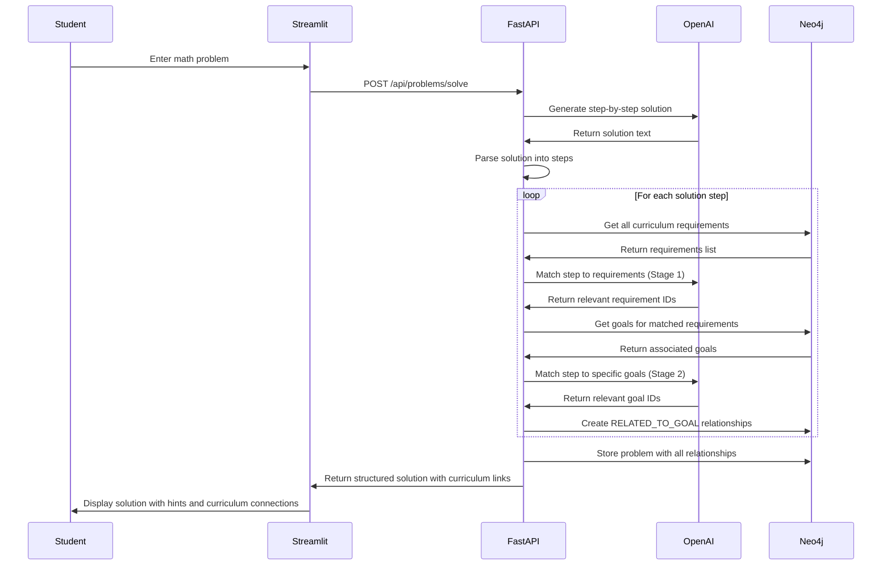
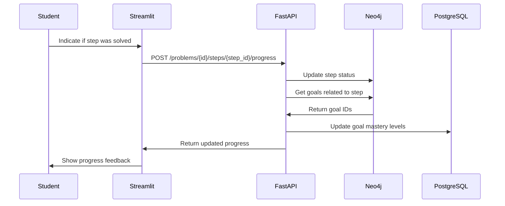
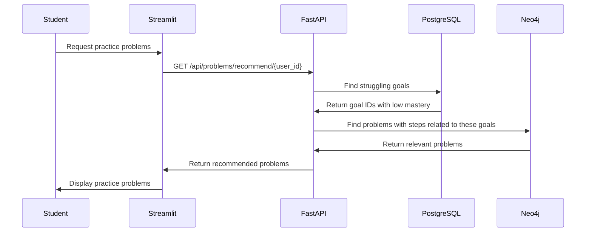

# AI Math Tutor App - MVP Documentation

## Project Overview

The AI Math Tutor is an intelligent learning platform designed specifically for students struggling with mathematics. The application connects problem-solving steps with curriculum requirements from the Polish educational system, helping students identify and address knowledge gaps through personalized learning.

### Core Value Proposition
- **Step-by-step guided learning** with hints before solutions
- **Curriculum-aligned explanations** mapped to the Polish core curriculum
- **Knowledge gap identification** through interactive problem-solving
- **Personalized learning experience** that adapts to student difficulties

## Technical Architecture

### Tech Stack
- **Backend**: FastAPI (Python)
- **Frontend**: Streamlit (for rapid MVP development)
- **Databases**:
  - Neo4j: Knowledge graph for curriculum, problems, solutions, and their relationships
  - PostgreSQL: User account management and authentication
- **AI Integration**: OpenAI API for problem-solving and curriculum matching

### System Architecture

```
┌───────────────┐      ┌───────────────┐      ┌───────────────┐
│               │      │               │      │               │
│   Streamlit   │<─────┤   FastAPI     │<─────┤   OpenAI API  │
│   Frontend    │      │   Backend     │      │               │
│               │      │               │      │               │
└───────┬───────┘      └───────┬───────┘      └───────────────┘
        │                      │
        │                      │
┌───────▼───────┐      ┌───────▼───────┐
│               │      │               │
│  PostgreSQL   │      │    Neo4j      │
│  User Data    │      │  Knowledge    │
│               │      │    Graph      │
└───────────────┘      └───────────────┘
```

## Data Model

### Neo4j Knowledge Graph

#### Nodes
- **Chapter**: Represents a chapter in the Polish math curriculum
  ```
  (:Chapter {
      id: String,
      name: String,
      grade_level: Integer
  })
  ```

- **Requirement**: Represents a specific requirement from the Polish math curriculum
  ```
  (:Requirement {
      id: String,
      description: String
  })
  ```

- **Goal**: Educational goals associated with requirements
  ```
  (:Goal {
      id: String,
      description: String
  })
  ```

- **Problem**: Represents a mathematical problem
  ```
  (:Problem {
      id: String,
      text: String,
      subject_area: String,
      difficulty: Integer,
      user_id: Integer,
      created_at: DateTime
  })
  ```

- **SolutionStep**: Represents one step in solving a problem
  ```
  (:SolutionStep {
      id: String,
      step_number: Integer,
      description: String,
      hint: String,
      solution: String,
      user_solved: Boolean,
      solved_with_hint: Boolean
  })
  ```

#### Relationships
- `(:Chapter)-[:HAS_REQUIREMENT]->(:Requirement)`: Links chapters to their requirements
- `(:Requirement)-[:HAS_GOAL]->(:Goal)`: Links requirements to their educational goals
- `(:Problem)-[:HAS_STEP]->(:SolutionStep)`: Connects a problem to its solution steps
- `(:SolutionStep)-[:RELATED_TO_GOAL]->(:Goal)`: Links solution steps to relevant curriculum goals
- `(:User)-[:ATTEMPTED]->(:Problem)`: Tracks problems attempted by users

### PostgreSQL Schema

#### Users
```sql
CREATE TABLE users (
    id SERIAL PRIMARY KEY,
    username VARCHAR(100) UNIQUE NOT NULL,
    email VARCHAR(100) UNIQUE NOT NULL,
    hashed_password VARCHAR(255) NOT NULL,
    grade_level INTEGER,
    created_at TIMESTAMP DEFAULT CURRENT_TIMESTAMP,
    last_login TIMESTAMP
);
```

#### GoalProgress
```sql
CREATE TABLE goal_progress (
    id SERIAL PRIMARY KEY,
    user_id INTEGER REFERENCES users(id),
    goal_id VARCHAR(100) NOT NULL,
    mastery_level FLOAT DEFAULT 0.0,
    attempts_count INTEGER DEFAULT 0,
    successful_attempts INTEGER DEFAULT 0,
    last_practiced TIMESTAMP,
    UNIQUE(user_id, goal_id)
);
```

## Curriculum Matching System

The MVP uses a two-stage LLM-based matching approach to connect solution steps with curriculum goals:

### Stage 1: Requirement Matching
1. Retrieve all requirements from the curriculum
2. For each solution step, use the LLM to identify relevant requirements
3. The LLM analyzes the step and determines which requirements are being addressed

### Stage 2: Goal Matching
1. For the identified requirements, query Neo4j to get their associated goals
2. Use the LLM to refine the matching, linking each solution step to specific goals
3. Create relationships in Neo4j between solution steps and curriculum goals

### Matching Implementation
```python
def match_step_to_curriculum(step_description, step_solution):
    """Match a solution step to curriculum requirements and goals using LLM"""
    # Get all requirements from Neo4j
    requirements = get_all_curriculum_requirements()
    
    # Format requirements for LLM context
    requirements_text = "\n".join([f"ID: {r['id']} - {r['description']}" for r in requirements])
    
    # First matching stage: Find relevant requirements
    prompt = f"""
    You are an expert in the Polish mathematics curriculum.
    
    Below is a step in solving a math problem:
    Step Description: {step_description}
    Step Solution: {step_solution}
    
    Below are curriculum requirements from the Polish math curriculum:
    {requirements_text}
    
    Identify the curriculum requirements that are most relevant to this solution step.
    Return only the IDs of the relevant requirements, separated by commas.
    """
    
    response = openai.ChatCompletion.create(
        model="gpt-4",
        messages=[
            {"role": "system", "content": "You are an education curriculum expert."},
            {"role": "user", "content": prompt}
        ]
    )
    
    # Parse requirement IDs from response
    requirement_ids = parse_ids_from_response(response.choices[0].message.content)
    
    # Get goals associated with these requirements
    goals = get_goals_for_requirements(requirement_ids)
    
    # Format goals for LLM context
    goals_text = "\n".join([f"ID: {g['id']} - {g['description']}" for g in goals])
    
    # Second matching stage: Match to specific goals
    prompt = f"""
    You are an expert in the Polish mathematics curriculum.
    
    Below is a step in solving a math problem:
    Step Description: {step_description}
    Step Solution: {step_solution}
    
    Based on the requirements you identified, here are the associated educational goals:
    {goals_text}
    
    Which specific educational goals are being applied in this solution step?
    Return only the IDs of the relevant goals, separated by commas.
    """
    
    response = openai.ChatCompletion.create(
        model="gpt-4",
        messages=[
            {"role": "system", "content": "You are an education curriculum expert."},
            {"role": "user", "content": prompt}
        ]
    )
    
    # Parse goal IDs from response
    goal_ids = parse_ids_from_response(response.choices[0].message.content)
    
    return goal_ids
```

## API Endpoints

### Authentication
```
POST /api/auth/register
POST /api/auth/login
GET /api/auth/user
```

### Problem Solving
```
POST /api/problems/solve
  - Submit a problem for solution
  - Body: {problem_text, subject_area, grade_level}
  - Returns: {problem_id, solution_steps[]}

GET /api/problems/{problem_id}
  - Get a specific problem solution

POST /api/problems/{problem_id}/steps/{step_id}/progress
  - Track user progress on solution steps
  - Body: {solved_with_hint: boolean}
```

### Curriculum and Progress
```
GET /api/curriculum/chapters
  - Get curriculum chapters

GET /api/curriculum/requirements/{chapter_id}
  - Get requirements for a chapter

GET /api/curriculum/goals/{requirement_id}
  - Get goals for a requirement

GET /api/problems/recommend/{user_id}
  - Get problems recommended based on struggling goals

GET /api/progress/{user_id}
  - Get user's learning progress stats
```

## Core System Flows

### 1. Problem Solving and Curriculum Matching Flow



### 2. User Progress Tracking Flow



### 3. Problem Recommendation Flow



## Implementation Plan

### Phase 1: Database Setup (1 week)
- [x] Configure Neo4j with existing Polish curriculum (chapters, requirements, goals)
- [ ] Extend Neo4j schema for problems and solution steps
- [ ] Set up PostgreSQL for user management
- [ ] Create initial database connections in FastAPI

### Phase 2: Core Backend (2 weeks)
- [ ] Set up FastAPI project structure
- [ ] Implement authentication endpoints
- [ ] Build OpenAI integration for problem-solving
- [ ] Create solution parsing algorithm
- [ ] Implement LLM-based curriculum matching system
- [ ] Develop progress tracking system

### Phase 3: Streamlit Frontend (1-2 weeks)
- [ ] Create user authentication screens
- [ ] Build problem submission interface
- [ ] Develop interactive solution viewer with hints
- [ ] Implement simple progress dashboard
- [ ] Create recommended problems view

### Phase 4: Testing and Refinement (1 week)
- [ ] Internal testing with sample problems
- [ ] User testing with students
- [ ] Performance optimization
- [ ] Bug fixes and UX improvements

## Key Implementation Code

### 1. Problem Solving with OpenAI

```python
def generate_solution(problem_text, grade_level=None):
    """Generate a step-by-step solution for a math problem"""
    prompt = f"""
    Solve this Polish math problem step by step:
    {problem_text}
    
    Format your answer as follows for each step:
    STEP 1: [Step description]
    HINT: [Hint that helps solve this step]
    SOLUTION: [Complete solution for this step]
    
    STEP 2: ...
    """
    
    response = openai.ChatCompletion.create(
        model="gpt-4",
        messages=[
            {"role": "system", "content": "You are a math tutor specializing in the Polish curriculum."},
            {"role": "user", "content": prompt}
        ]
    )
    
    solution_text = response.choices[0].message.content
    return parse_solution_steps(solution_text)
```

### 2. Store Problem with Curriculum Links in Neo4j

```python
def store_problem_with_curriculum_links(user_id, problem_text, subject_area, parsed_steps):
    """Store problem and link solution steps to curriculum goals in Neo4j"""
    with driver.session() as session:
        # Create problem node
        problem_id = str(uuid.uuid4())
        session.run("""
            CREATE (p:Problem {
                id: $id,
                text: $text,
                subject_area: $subject,
                user_id: $user_id,
                created_at: datetime()
            })
        """, id=problem_id, text=problem_text, subject=subject_area, user_id=user_id)
        
        # Process each step
        for idx, step in enumerate(parsed_steps):
            step_id = str(uuid.uuid4())
            
            # Create step node
            session.run("""
                MATCH (p:Problem {id: $problem_id})
                CREATE (s:SolutionStep {
                    id: $id,
                    step_number: $num,
                    description: $desc,
                    hint: $hint,
                    solution: $solution,
                    user_solved: false,
                    solved_with_hint: null
                })
                CREATE (p)-[:HAS_STEP]->(s)
            """, problem_id=problem_id, id=step_id, num=idx+1, 
                 desc=step["description"], hint=step["hint"], 
                 solution=step["solution"])
            
            # Match step to curriculum goals using LLM
            goal_ids = match_step_to_curriculum(step["description"], step["solution"])
            
            # Create relationships to goals
            for goal_id in goal_ids:
                session.run("""
                    MATCH (s:SolutionStep {id: $step_id})
                    MATCH (g:Goal {id: $goal_id})
                    CREATE (s)-[:RELATED_TO_GOAL]->(g)
                """, step_id=step_id, goal_id=goal_id)
                
        return problem_id
```

### 3. Update User Progress

```python
def update_user_progress(user_id, step_id, solved_with_hint):
    """Update user progress for a solution step"""
    # Update the step status in Neo4j
    with neo4j_driver.session() as session:
        session.run("""
            MATCH (s:SolutionStep {id: $step_id})
            SET s.user_solved = true,
                s.solved_with_hint = $solved_with_hint
        """, step_id=step_id, solved_with_hint=solved_with_hint)
        
        # Get related goals
        result = session.run("""
            MATCH (s:SolutionStep {id: $step_id})-[:RELATED_TO_GOAL]->(g:Goal)
            RETURN g.id as id, g.description as description
        """, step_id=step_id)
        
        goals = [r for r in result]
    
    # Update goal mastery in PostgreSQL
    for goal in goals:
        # Check if goal progress exists
        progress = db.query(GoalProgress).filter(
            GoalProgress.user_id == user_id,
            GoalProgress.goal_id == goal["id"]
        ).first()
        
        if progress:
            # Update existing progress
            progress.attempts_count += 1
            if solved_with_hint:
                progress.successful_attempts += 1
            
            # Recalculate mastery level
            progress.mastery_level = progress.successful_attempts / progress.attempts_count
            progress.last_practiced = datetime.utcnow()
        else:
            # Create new goal progress
            new_progress = GoalProgress(
                user_id=user_id,
                goal_id=goal["id"],
                mastery_level=1.0 if solved_with_hint else 0.0,
                attempts_count=1,
                successful_attempts=1 if solved_with_hint else 0,
                last_practiced=datetime.utcnow()
            )
            db.add(new_progress)
        
        db.commit()
    
    return {"success": True, "updated_goals": len(goals)}
```

### 4. Recommend Problems Based on Struggling Goals

```python
def get_recommended_problems(user_id, limit=5):
    """Find problems that target goals the user is struggling with"""
    # Get struggling goals from PostgreSQL
    struggling_goals = db.query(GoalProgress).filter(
        GoalProgress.user_id == user_id,
        GoalProgress.mastery_level < 0.6
    ).order_by(GoalProgress.mastery_level.asc()).limit(10).all()
    
    goal_ids = [goal.goal_id for goal in struggling_goals]
    
    # Find problems targeting these goals in Neo4j
    with neo4j_driver.session() as session:
        result = session.run("""
            MATCH (g:Goal)<-[:RELATED_TO_GOAL]-(s:SolutionStep)<-[:HAS_STEP]-(p:Problem)
            WHERE g.id IN $goal_ids
            AND NOT EXISTS {
                MATCH (p)<-[:ATTEMPTED]-({id: $user_id})
            }
            RETURN DISTINCT p.id as id, p.text as text, p.subject_area as subject_area,
                   collect(DISTINCT g.id) as goal_ids
            LIMIT $limit
        """, goal_ids=goal_ids, user_id=user_id, limit=limit)
        
        return [r for r in result]
```

## Streamlit App Structure

### Main Pages

1. **Authentication Page**
```python
def auth_page():
    st.title("Math Tutor Login")
    
    tab1, tab2 = st.tabs(["Login", "Register"])
    
    with tab1:
        username = st.text_input("Username", key="login_username")
        password = st.text_input("Password", type="password", key="login_password")
        
        if st.button("Login"):
            response = requests.post(
                f"{API_URL}/api/auth/login",
                json={"username": username, "password": password}
            )
            
            if response.status_code == 200:
                data = response.json()
                st.session_state.user_id = data["user_id"]
                st.session_state.token = data["token"]
                st.session_state.logged_in = True
                st.rerun()
            else:
                st.error("Login failed. Please check your credentials.")
    
    with tab2:
        # Registration form
        # ...
```

2. **Problem Input Page**
```python
def problem_page():
    st.title("Solve Math Problem")
    
    problem_text = st.text_area("Enter your math problem:", height=150)
    subject_area = st.selectbox(
        "Subject Area (optional)", 
        ["", "Algebra", "Geometry", "Arithmetic", "Statistics", "Trigonometry"]
    )
    
    if st.button("Solve"):
        with st.spinner("Generating solution..."):
            response = requests.post(
                f"{API_URL}/api/problems/solve",
                json={
                    "problem_text": problem_text,
                    "subject_area": subject_area if subject_area else None,
                    "grade_level": st.session_state.get("grade_level")
                },
                headers={"Authorization": f"Bearer {st.session_state.token}"}
            )
            
            if response.status_code == 200:
                solution_data = response.json()
                st.session_state.current_solution = solution_data
                st.rerun()
            else:
                st.error("Error generating solution")
```

3. **Solution Display Page**
```python
def solution_page():
    solution = st.session_state.current_solution
    
    st.title("Step-by-Step Solution")
    st.write(f"Problem: {solution['problem_text']}")
    
    for i, step in enumerate(solution['solution_steps']):
        with st.expander(f"Step {i+1}: {step['description']}", expanded=True):
            tab1, tab2, tab3 = st.tabs(["Hint", "Solution", "Curriculum"])
            
            with tab1:
                st.write(step['hint'])
                
                col1, col2 = st.columns(2)
                with col1:
                    if st.button("I solved it with the hint", key=f"hint_{i}"):
                        update_progress(solution['problem_id'], step['id'], True)
                        # Mark this step as completed
                        
                with col2:
                    if st.button("Show me the solution", key=f"show_{i}"):
                        st.session_state[f"show_solution_{i}"] = True
                        st.rerun()
            
            with tab2:
                if st.session_state.get(f"show_solution_{i}", False):
                    st.write(step['solution'])
                    
                    if st.button("I understand now", key=f"understand_{i}"):
                        update_progress(solution['problem_id'], step['id'], False)
                        # Mark this step as completed with solution help
                else:
                    st.info("Try using the hint first!")
            
            with tab3:
                st.write("This step relates to these curriculum goals:")
                for goal in step['curriculum_goals']:
                    st.write(f"- {goal['description']}")
                    with st.expander("Related Requirements"):
                        for req in goal['requirements']:
                            st.write(f"• {req['description']}")
```

## Testing & Deployment

### Testing Strategy
1. **Internal Testing**:
   - Test the LLM-based curriculum matching with sample problems
   - Verify correct matching of solution steps to goals
   - Test user flow and progress tracking

2. **Student Testing**:
   - Have students test with their own homework problems
   - Collect feedback on hint helpfulness
   - Measure if students can solve more problems after using the system

### Deployment Options
1. **Development**:
   - FastAPI on local development server
   - Neo4j and PostgreSQL in Docker containers
   - Streamlit run locally

2. **Initial Deployment**:
   - FastAPI on Heroku or Railway
   - Neo4j AuraDB free tier
   - PostgreSQL on Railway or Heroku
   - Streamlit Cloud for frontend

## Success Metrics

The MVP will be considered successful if:

1. Students report the tool is helpful for understanding math problems
2. Students can independently solve steps after seeing hints
3. The system correctly maps solution steps to curriculum goals
4. User progress is accurately tracked over time

## Future Enhancements

1. **Embedding-Based Matching**:
   - Replace or supplement LLM matching with embedding-based approaches
   - Create embeddings for curriculum goals and solution steps
   - Use vector similarity for faster and potentially more accurate matching

2. **Personalized Problem Generator**:
   - Create custom practice problems targeting weak areas
   
3. **Interactive Visualizations**:
   - Add visual aids for geometric problems
   
4. **Multiple Language Support**:
   - Expand beyond Polish curriculum
   
5. **Teacher Dashboard**:
   - Allow educators to monitor student progress